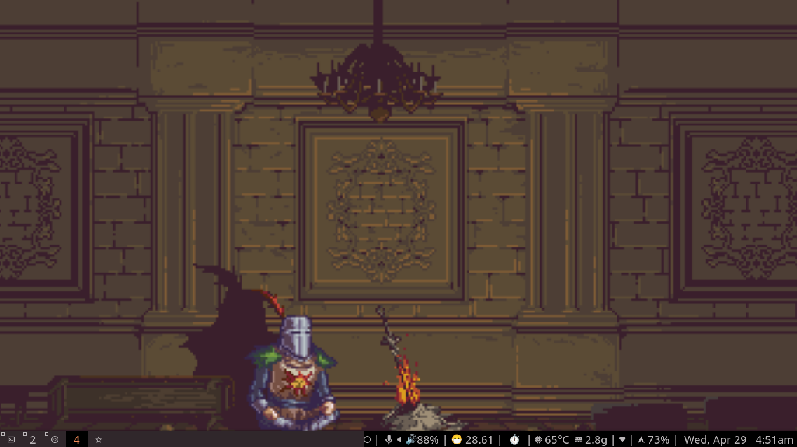

    
### tmux
forked sin-cy's tmux
(https://github.com/Sin-cy/dotfiles "dotfiles")


### nvim
forked bread's config
(https://github.com/BreadOnPenguins/dots "dotfiles")

```

### xdg

```bash
xev -event keyboard
# check for key binds

desktop-file-utils
.config/mimeapps.list

```

Add corresponding readme's

```bash

sudo pacman -S firefoxpwa
sudo ln -s /usr/bin/mozilla/native-messaging-hosts/firefoxpwa.json /usr/bin/_your_browser_/native-message-hosts/firefoxpwa.json 
firefoxpwa runtime install
```

### dotbot

- to test
    ./dotbot/bin/dotbot -v -d . -c install.conf.yaml

